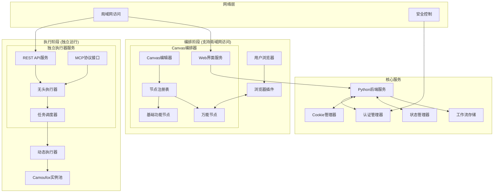

# 设计文档

## 概述

动态网页操作自动化工具采用微服务架构，遵循"像细菌一样"的设计原则：小巧、模块化、自包含。系统分为编排阶段和执行阶段，通过浏览器插件、编排器、执行器和后端服务的协同工作，实现复杂的网页自动化任务。

## 架构

### 系统架构图



### 核心组件

1. **浏览器插件** (Browser Extension)
   - 元素选择和高亮
   - 操作定义界面
   - 与编排器的实时通信

2. **可视化编排器** (Visual Orchestrator)
   - Canvas节点编辑器
   - 万能节点和基本功能节点
   - 工作流JSON生成

3. **动态执行器** (Dynamic Executor)
   - 任务状态机管理
   - Camoufox实例控制
   - 工作流解析执行

4. **Python后端服务** (Backend Service)
   - RESTful API服务
   - 文件操作管理
   - 组件间通信协调

## 组件和接口

### 1. 浏览器插件 (Browser Extension)

#### 核心模块
```javascript
// content-script.js - 页面内容脚本
class ElementSelector {
    highlightElement(element)
    captureElement(element)
    generateSelectors(element)
}

class OperationDefiner {
    showOperationMenu(element)
    defineOperation(type, params)
    addDelay(milliseconds)
}

class PluginCommunicator {
    connectToOrchestrator(nodeId)
    sendElementData(elementData)
    receiveNodeUpdates(callback)
}
```

#### 接口定义
```typescript
interface ElementData {
    selectors: {
        css: string;
        xpath: string;
        attributes: Record<string, string>;
    };
    operations: Operation[];
    metadata: {
        tagName: string;
        text: string;
        position: { x: number; y: number };
    };
}

interface Operation {
    type: 'click' | 'input' | 'hover' | 'extract' | 'keyboard';
    params: Record<string, any>;
    delay?: number;
}
```

### 2. 可视化编排器 (Visual Orchestrator)

#### Canvas节点系统设计 (参考ComfyUI)

```typescript
// canvas-system.ts
interface NodeDefinition {
    type: string;
    category: string;
    title: string;
    inputs: InputSocket[];
    outputs: OutputSocket[];
    properties: PropertyDefinition[];
    ui_config: UIConfig;
}

interface InputSocket {
    name: string;
    type: 'string' | 'number' | 'boolean' | 'object' | 'array';
    required: boolean;
    default_value?: any;
    validation?: ValidationRule[];
}

interface OutputSocket {
    name: string;
    type: 'string' | 'number' | 'boolean' | 'object' | 'array';
    description: string;
}

interface PropertyDefinition {
    name: string;
    type: 'text' | 'number' | 'select' | 'checkbox' | 'textarea' | 'file';
    label: string;
    default_value: any;
    options?: string[] | { value: any, label: string }[];
    validation?: ValidationRule[];
}

interface UIConfig {
    width: number;
    height: number;
    color: string;
    icon?: string;
    collapsible: boolean;
    form_layout: 'vertical' | 'horizontal' | 'grid';
}
```

#### 核心Canvas组件

```typescript
// canvas-editor.ts
class CanvasEditor {
    private canvas: HTMLCanvasElement;
    private nodes: Map<string, NodeInstance> = new Map();
    private connections: Connection[] = [];
    private nodeRegistry: NodeRegistry;
    
    // 节点管理
    addNode(nodeType: string, position: {x: number, y: number}): NodeInstance
    removeNode(nodeId: string): void
    duplicateNode(nodeId: string): NodeInstance
    
    // 连接管理
    connectSockets(fromNode: string, fromSocket: string, toNode: string, toSocket: string): Connection
    disconnectSockets(connectionId: string): void
    validateConnection(from: SocketRef, to: SocketRef): boolean
    
    // 工作流管理
    exportWorkflow(): WorkflowJSON
    importWorkflow(workflow: WorkflowJSON): void
    validateWorkflow(): ValidationResult[]
    
    // 渲染和交互
    render(): void
    handleMouseEvents(): void
    handleKeyboardEvents(): void
}

class NodeInstance {
    id: string;
    type: string;
    position: {x: number, y: number};
    size: {width: number, height: number};
    properties: Map<string, any> = new Map();
    inputValues: Map<string, any> = new Map();
    outputValues: Map<string, any> = new Map();
    
    // 表单配置
    renderPropertyForm(): HTMLElement
    updateProperty(name: string, value: any): void
    validateProperties(): ValidationResult[]
    
    // 执行相关
    canExecute(): boolean
    getExecutionData(): NodeExecutionData
}
```

#### 节点注册系统

```typescript
// node-registry.ts
class NodeRegistry {
    private nodeDefinitions: Map<string, NodeDefinition> = new Map();
    
    registerNode(definition: NodeDefinition): void
    getNodeDefinition(type: string): NodeDefinition
    getNodesByCategory(category: string): NodeDefinition[]
    createNodeInstance(type: string): NodeInstance
}

// 预定义节点类型
const BUILTIN_NODES: NodeDefinition[] = [
    {
        type: 'universal_action',
        category: 'Web Actions',
        title: '万能操作节点',
        inputs: [
            { name: 'browser_handle', type: 'object', required: false, description: '浏览器句柄输入' },
            { name: 'variables', type: 'object', required: false, description: '输入变量' }
        ],
        outputs: [
            { name: 'browser_handle', type: 'object', description: '浏览器句柄输出' },
            { name: 'result', type: 'object', description: '操作执行结果' },
            { name: 'extracted_data', type: 'object', description: '提取的数据' }
        ],
        properties: [
            { name: 'target_url', type: 'text', label: '目标URL', default_value: '' },
            { name: 'wait_timeout', type: 'number', label: '等待超时(秒)', default_value: 10 },
            { name: 'retry_count', type: 'number', label: '重试次数', default_value: 3 }
        ],
        ui_config: {
            width: 300,
            height: 400,
            color: '#4CAF50',
            icon: 'web',
            collapsible: true,
            form_layout: 'vertical'
        }
    },
    {
        type: 'condition_check',
        category: 'Logic',
        title: '条件判断',
        inputs: [
            { name: 'browser_handle', type: 'object', required: false, description: '浏览器句柄输入' },
            { name: 'input_value', type: 'string', required: true },
            { name: 'compare_value', type: 'string', required: true }
        ],
        outputs: [
            { name: 'browser_handle', type: 'object', description: '浏览器句柄输出' },
            { name: 'true_branch', type: 'object', description: '条件为真时的输出' },
            { name: 'false_branch', type: 'object', description: '条件为假时的输出' }
        ],
        properties: [
            { 
                name: 'operator', 
                type: 'select', 
                label: '比较操作符', 
                default_value: 'equals',
                options: [
                    { value: 'equals', label: '等于' },
                    { value: 'contains', label: '包含' },
                    { value: 'regex', label: '正则匹配' }
                ]
            }
        ],
        ui_config: {
            width: 250,
            height: 200,
            color: '#FF9800',
            icon: 'decision',
            collapsible: false,
            form_layout: 'vertical'
        }
    },
    {
        type: 'delay_wait',
        category: 'Utilities',
        title: '延时等待',
        inputs: [
            { name: 'browser_handle', type: 'object', required: false, description: '浏览器句柄输入' }
        ],
        outputs: [
            { name: 'browser_handle', type: 'object', description: '浏览器句柄输出' },
            { name: 'continue', type: 'object', description: '延时完成后继续' }
        ],
        properties: [
            { name: 'delay_seconds', type: 'number', label: '延时秒数', default_value: 1 },
            { 
                name: 'delay_type', 
                type: 'select', 
                label: '延时类型',
                default_value: 'fixed',
                options: [
                    { value: 'fixed', label: '固定延时' },
                    { value: 'random', label: '随机延时' }
                ]
            }
        ],
        ui_config: {
            width: 200,
            height: 150,
            color: '#9C27B0',
            icon: 'timer',
            collapsible: false,
            form_layout: 'vertical'
        }
    }
];
```

#### 万能节点详细设计 - 操作子体系

```typescript
// universal-node.ts
interface OperationUnit {
    id: string;
    observation: ObservationStep;
    action: ActionStep;
    condition?: ConditionCheck;
    loop?: LoopConfig;
}

interface ObservationStep {
    type: 'element_exists' | 'text_contains' | 'attribute_equals' | 'page_loaded';
    target: ElementLocator;
    expected_value?: string;
    timeout_ms: number;
    retry_count: number;
}

interface ActionStep {
    type: 'click' | 'input' | 'hover' | 'scroll' | 'extract' | 'navigate' | 'wait';
    target?: ElementLocator;
    parameters: Record<string, any>;
    validation?: ObservationStep; // 动作后的验证观察
}

interface ConditionCheck {
    type: 'if' | 'while' | 'until';
    condition: ObservationStep;
    true_branch?: OperationUnit[];
    false_branch?: OperationUnit[];
}

interface LoopConfig {
    type: 'for' | 'while' | 'foreach';
    condition: string | number | ObservationStep;
    max_iterations: number;
    break_condition?: ObservationStep;
}

class UniversalActionNode extends NodeInstance {
    private operationUnits: OperationUnit[] = [];
    private pluginConnection: WebSocket | null = null;
    private browserHandleInput: string = 'browser_handle'; // 输入的浏览器句柄
    private browserHandleOutput: string = 'browser_handle'; // 输出的浏览器句柄
    
    // 操作子管理
    addOperationUnit(): OperationUnit {
        const unit: OperationUnit = {
            id: generateId(),
            observation: {
                type: 'element_exists',
                target: { primary: { type: 'css', value: '' }, fallbacks: [] },
                timeout_ms: 5000,
                retry_count: 3
            },
            action: {
                type: 'click',
                parameters: {},
                validation: {
                    type: 'element_exists',
                    target: { primary: { type: 'css', value: '' }, fallbacks: [] },
                    timeout_ms: 2000,
                    retry_count: 1
                }
            }
        };
        this.operationUnits.push(unit);
        return unit;
    }
    
    // 渲染操作子表单
    private renderOperationUnit(unit: OperationUnit, index: number): HTMLElement {
        const unitDiv = document.createElement('div');
        unitDiv.className = 'operation-unit';
        
        // 操作子标题
        const header = document.createElement('div');
        header.className = 'unit-header';
        header.innerHTML = `<strong>操作子 ${index + 1}</strong>`;
        
        // 观察步骤配置
        const observationSection = this.renderObservationStep(unit.observation, index);
        
        // 动作步骤配置
        const actionSection = this.renderActionStep(unit.action, index);
        
        // 条件和循环配置
        const logicSection = this.renderLogicControls(unit, index);
        
        unitDiv.appendChild(header);
        unitDiv.appendChild(observationSection);
        unitDiv.appendChild(actionSection);
        unitDiv.appendChild(logicSection);
        
        return unitDiv;
    }
    
    private renderObservationStep(observation: ObservationStep, unitIndex: number): HTMLElement {
        const section = document.createElement('div');
        section.className = 'observation-section';
        section.innerHTML = `
            <h4>观察步骤</h4>
            <select onchange="this.updateObservationType(${unitIndex}, this.value)">
                <option value="element_exists">元素存在</option>
                <option value="text_contains">文本包含</option>
                <option value="attribute_equals">属性等于</option>
                <option value="page_loaded">页面加载完成</option>
            </select>
            <input type="text" placeholder="目标选择器" value="${observation.target.primary.value}">
            <input type="number" placeholder="超时时间(ms)" value="${observation.timeout_ms}">
            <input type="number" placeholder="重试次数" value="${observation.retry_count}">
        `;
        return section;
    }
    
    private renderActionStep(action: ActionStep, unitIndex: number): HTMLElement {
        const section = document.createElement('div');
        section.className = 'action-section';
        section.innerHTML = `
            <h4>动作步骤</h4>
            <select onchange="this.updateActionType(${unitIndex}, this.value)">
                <option value="click">点击</option>
                <option value="input">输入</option>
                <option value="hover">悬停</option>
                <option value="scroll">滚动</option>
                <option value="extract">提取</option>
                <option value="navigate">导航</option>
                <option value="wait">等待</option>
            </select>
            <div class="action-parameters">
                ${this.renderActionParameters(action)}
            </div>
            <div class="action-validation">
                <label><input type="checkbox"> 启用动作验证</label>
            </div>
        `;
        return section;
    }
    
    private renderLogicControls(unit: OperationUnit, unitIndex: number): HTMLElement {
        const section = document.createElement('div');
        section.className = 'logic-section';
        section.innerHTML = `
            <h4>逻辑控制</h4>
            <div class="condition-controls">
                <label><input type="checkbox"> 条件判断</label>
                <select disabled>
                    <option value="if">如果</option>
                    <option value="while">当...时</option>
                    <option value="until">直到...时</option>
                </select>
            </div>
            <div class="loop-controls">
                <label><input type="checkbox"> 循环执行</label>
                <select disabled>
                    <option value="for">固定次数</option>
                    <option value="while">条件循环</option>
                    <option value="foreach">遍历循环</option>
                </select>
                <input type="number" placeholder="最大迭代次数" disabled>
            </div>
        `;
        return section;
    }
    
    // 生成执行数据
    getExecutionData(): NodeExecutionData {
        return {
            node_id: this.id,
            node_type: this.type,
            properties: Object.fromEntries(this.properties),
            operation_units: this.operationUnits,
            browser_handle_input: this.browserHandleInput,
            browser_handle_output: this.browserHandleOutput,
            headless_mode: true
        };
    }
}
```

#### 浏览器句柄传递机制

```typescript
// browser-handle-manager.ts
interface BrowserHandle {
    instance_id: string;
    session_id: string;
    current_url: string;
    cookies: Record<string, any>;
    local_storage: Record<string, any>;
    window_handles: string[];
    current_window: string;
    page_state: {
        loading: boolean;
        ready_state: string;
        scroll_position: { x: number; y: number };
    };
}

class BrowserHandleManager {
    private handles: Map<string, BrowserHandle> = new Map();
    private nodeHandleMapping: Map<string, string> = new Map();
    
    // 创建新的浏览器句柄
    createHandle(nodeId: string): BrowserHandle {
        const handle: BrowserHandle = {
            instance_id: generateId(),
            session_id: generateId(),
            current_url: '',
            cookies: {},
            local_storage: {},
            window_handles: [],
            current_window: '',
            page_state: {
                loading: false,
                ready_state: 'complete',
                scroll_position: { x: 0, y: 0 }
            }
        };
        
        this.handles.set(handle.instance_id, handle);
        this.nodeHandleMapping.set(nodeId, handle.instance_id);
        return handle;
    }
    
    // 传递句柄到下一个节点
    transferHandle(fromNodeId: string, toNodeId: string): BrowserHandle | null {
        const handleId = this.nodeHandleMapping.get(fromNodeId);
        if (!handleId) return null;
        
        const handle = this.handles.get(handleId);
        if (!handle) return null;
        
        // 更新句柄映射
        this.nodeHandleMapping.set(toNodeId, handleId);
        
        return handle;
    }
    
    // 更新句柄状态
    updateHandle(instanceId: string, updates: Partial<BrowserHandle>): void {
        const handle = this.handles.get(instanceId);
        if (handle) {
            Object.assign(handle, updates);
        }
    }
    
    // 释放句柄
    releaseHandle(nodeId: string): void {
        const handleId = this.nodeHandleMapping.get(nodeId);
        if (handleId) {
            this.handles.delete(handleId);
            this.nodeHandleMapping.delete(nodeId);
        }
    }
}

// 节点执行时的浏览器句柄处理
class NodeExecutor {
    private handleManager: BrowserHandleManager;
    
    async executeNode(nodeData: NodeExecutionData, inputHandle?: BrowserHandle): Promise<{
        result: any;
        outputHandle: BrowserHandle;
    }> {
        // 获取或创建浏览器句柄
        let browserHandle = inputHandle;
        if (!browserHandle) {
            browserHandle = this.handleManager.createHandle(nodeData.node_id);
        }
        
        // 执行节点操作
        const result = await this.executeOperationUnits(
            nodeData.operation_units, 
            browserHandle
        );
        
        // 更新句柄状态
        this.handleManager.updateHandle(browserHandle.instance_id, {
            current_url: await this.getCurrentUrl(browserHandle),
            page_state: await this.getPageState(browserHandle)
        });
        
        return {
            result,
            outputHandle: browserHandle
        };
    }
    
    private async executeOperationUnits(
        units: OperationUnit[], 
        handle: BrowserHandle
    ): Promise<any> {
        const results = [];
        
        for (const unit of units) {
            // 执行观察步骤
            const observationResult = await this.executeObservation(unit.observation, handle);
            
            if (observationResult.success) {
                // 执行动作步骤
                const actionResult = await this.executeAction(unit.action, handle);
                
                // 处理条件和循环逻辑
                if (unit.condition) {
                    const conditionResult = await this.handleCondition(unit.condition, handle);
                    results.push({ unit: unit.id, observation: observationResult, action: actionResult, condition: conditionResult });
                } else if (unit.loop) {
                    const loopResult = await this.handleLoop(unit.loop, unit, handle);
                    results.push({ unit: unit.id, loop: loopResult });
                } else {
                    results.push({ unit: unit.id, observation: observationResult, action: actionResult });
                }
            } else {
                // 观察失败，记录错误
                results.push({ unit: unit.id, error: observationResult.error });
            }
        }
        
        return results;
    }
}
```

#### 跨节点浏览器状态管理

```typescript
// workflow-execution.ts
class WorkflowExecutor {
    private handleManager: BrowserHandleManager;
    private nodeExecutor: NodeExecutor;
    
    async executeWorkflow(workflow: CanvasWorkflowJSON): Promise<ExecutionResult> {
        const executionPlan = this.createExecutionPlan(workflow);
        const handleChain: Map<string, BrowserHandle> = new Map();
        
        for (const step of executionPlan) {
            // 获取输入句柄
            const inputHandle = this.getInputHandle(step, handleChain, workflow.connections);
            
            // 执行节点
            const result = await this.nodeExecutor.executeNode(step, inputHandle);
            
            // 保存输出句柄
            handleChain.set(step.node_id, result.outputHandle);
            
            // 处理句柄传递到下游节点
            this.propagateHandle(step.node_id, result.outputHandle, workflow.connections);
        }
        
        return { success: true, handle_chain: handleChain };
    }
    
    private getInputHandle(
        nodeData: NodeExecutionData, 
        handleChain: Map<string, BrowserHandle>,
        connections: CanvasConnection[]
    ): BrowserHandle | undefined {
        // 查找连接到当前节点的浏览器句柄输入
        const inputConnection = connections.find(conn => 
            conn.to_node === nodeData.node_id && 
            conn.to_socket === 'browser_handle'
        );
        
        if (inputConnection) {
            return handleChain.get(inputConnection.from_node);
        }
        
        return undefined;
    }
    
    private propagateHandle(
        nodeId: string, 
        handle: BrowserHandle, 
        connections: CanvasConnection[]
    ): void {
        // 将句柄传递给所有连接的下游节点
        const outputConnections = connections.filter(conn => 
            conn.from_node === nodeId && 
            conn.from_socket === 'browser_handle'
        );
        
        outputConnections.forEach(conn => {
            this.handleManager.transferHandle(nodeId, conn.to_node);
        });
    }
}
```

#### 无头执行支持

```typescript
// headless-execution.ts
interface HeadlessWorkflow {
    nodes: NodeExecutionData[];
    connections: ConnectionData[];
    execution_config: {
        parallel_execution: boolean;
        error_handling: 'stop' | 'continue' | 'retry';
        timeout_seconds: number;
    };
}

class HeadlessExecutor {
    async executeWorkflow(workflow: HeadlessWorkflow): Promise<ExecutionResult> {
        const executionPlan = this.createExecutionPlan(workflow);
        const results: Map<string, any> = new Map();
        
        for (const step of executionPlan) {
            try {
                const result = await this.executeNode(step, results);
                results.set(step.node_id, result);
            } catch (error) {
                if (workflow.execution_config.error_handling === 'stop') {
                    throw error;
                }
                // 继续执行或重试逻辑
            }
        }
        
        return { success: true, results: Object.fromEntries(results) };
    }
    
    private createExecutionPlan(workflow: HeadlessWorkflow): NodeExecutionData[] {
        // 基于连接关系创建执行顺序
        // 支持并行执行的节点识别
        return this.topologicalSort(workflow.nodes, workflow.connections);
    }
}
```

#### Canvas工作流数据结构
```typescript
interface CanvasNodeInstance {
    id: string;
    type: string;
    position: { x: number; y: number };
    size: { width: number; height: number };
    properties: Record<string, any>;
    input_connections: Record<string, ConnectionRef>;
    output_connections: Record<string, ConnectionRef[]>;
    ui_state: {
        collapsed: boolean;
        selected: boolean;
        error_state?: string;
    };
}

interface ConnectionRef {
    node_id: string;
    socket_name: string;
}

interface CanvasConnection {
    id: string;
    from_node: string;
    from_socket: string;
    to_node: string;
    to_socket: string;
    data_type: string;
}

interface CanvasWorkflowJSON {
    version: string;
    nodes: CanvasNodeInstance[];
    connections: CanvasConnection[];
    canvas_state: {
        zoom: number;
        pan: { x: number; y: number };
        grid_size: number;
    };
    execution_config: {
        mode: 'sequential' | 'parallel' | 'optimized';
        error_handling: 'stop' | 'continue' | 'retry';
        headless: boolean;
        timeout_seconds: number;
    };
    triggers: TriggerConfig[];
    metadata: {
        name: string;
        description: string;
        created_at: string;
        updated_at: string;
        version: string;
        tags: string[];
    };
}

// 执行时的简化数据结构
interface ExecutionWorkflow {
    nodes: NodeExecutionData[];
    execution_order: string[];
    variable_mappings: Record<string, any>;
    headless_mode: boolean;
}
```

### 3. 动态执行器 (Dynamic Executor)

#### 状态机管理
```python
# state_machine.py
from enum import Enum
from dataclasses import dataclass

class TaskState(Enum):
    WAITING = "waiting"
    EXECUTING = "executing"
    ERROR = "error"
    COMPLETED = "completed"

@dataclass
class Task:
    id: str
    workflow: dict
    state: TaskState
    trigger_config: dict
    created_at: datetime
    updated_at: datetime

class TaskStateMachine:
    def transition_to(self, task_id: str, new_state: TaskState) -> bool
    def execute_workflow(self, task_id: str) -> None
    def handle_error(self, task_id: str, error: Exception) -> None
```

#### Camoufox控制器
```python
# camoufox_controller.py
class CamoufoxInstance:
    def __init__(self, instance_id: str):
        self.instance_id = instance_id
        self.driver = None
        self.cookies = {}
    
    def start(self) -> None
    def stop(self) -> None
    def execute_operation(self, operation: dict) -> dict
    def load_cookies(self, domain: str) -> None

class InstancePool:
    def get_instance(self) -> CamoufoxInstance
    def release_instance(self, instance: CamoufoxInstance) -> None
    def scale_pool(self, target_size: int) -> None
```

### 4. Python后端服务 (Backend Service)

#### API服务
```python
# api_server.py
from fastapi import FastAPI, WebSocket

app = FastAPI()

@app.post("/workflows")
async def create_workflow(workflow: WorkflowCreate) -> WorkflowResponse

@app.get("/workflows/{workflow_id}")
async def get_workflow(workflow_id: str) -> WorkflowResponse

@app.post("/tasks")
async def create_task(task: TaskCreate) -> TaskResponse

@app.websocket("/plugin-connection/{node_id}")
async def plugin_websocket(websocket: WebSocket, node_id: str)
```

#### 通信协调器
```python
# communication_coordinator.py
class PluginOrchestratorBridge:
    def __init__(self):
        self.active_connections = {}
    
    async def connect_plugin_to_node(self, node_id: str, websocket: WebSocket)
    async def forward_element_data(self, node_id: str, element_data: dict)
    async def broadcast_node_update(self, node_id: str, update: dict)
```

## 数据模型

### 1. 元素定位数据
```typescript
interface ElementLocator {
    primary: {
        type: 'css' | 'xpath' | 'id' | 'class';
        value: string;
    };
    fallbacks: Array<{
        type: 'css' | 'xpath' | 'attributes';
        value: string | Record<string, string>;
    }>;
    validation: {
        expectedText?: string;
        expectedAttributes?: Record<string, string>;
    };
}
```

### 2. 任务实例数据
```python
# models.py
from sqlalchemy import Column, String, JSON, DateTime, Enum
from sqlalchemy.ext.declarative import declarative_base

Base = declarative_base()

class WorkflowInstance(Base):
    __tablename__ = "workflow_instances"
    
    id = Column(String, primary_key=True)
    name = Column(String, nullable=False)
    workflow_json = Column(JSON, nullable=False)
    created_at = Column(DateTime, nullable=False)
    updated_at = Column(DateTime, nullable=False)

class TaskExecution(Base):
    __tablename__ = "task_executions"
    
    id = Column(String, primary_key=True)
    workflow_id = Column(String, nullable=False)
    state = Column(Enum(TaskState), nullable=False)
    trigger_config = Column(JSON, nullable=False)
    execution_log = Column(JSON)
    created_at = Column(DateTime, nullable=False)
```

### 3. Cookie存储结构
```python
# cookie_models.py
@dataclass
class CookieStore:
    domain: str
    timestamp: datetime
    cookies: List[dict]
    
    @property
    def filename(self) -> str:
        return f"{self.domain}_{self.timestamp.strftime('%Y%m%d_%H%M%S')}.json"
```

## 错误处理

### 1. 分层错误处理策略

```python
# error_handling.py
class AutomationError(Exception):
    """基础自动化错误"""
    pass

class ElementNotFoundError(AutomationError):
    """元素未找到错误"""
    def __init__(self, locator: dict, page_url: str):
        self.locator = locator
        self.page_url = page_url

class CommunicationError(AutomationError):
    """通信错误"""
    def __init__(self, component: str, message: str):
        self.component = component
        self.message = message

class ErrorHandler:
    def handle_element_error(self, error: ElementNotFoundError) -> dict:
        # 尝试备用定位方式
        # 记录错误日志
        # 返回错误恢复策略
        pass
    
    def handle_communication_error(self, error: CommunicationError) -> dict:
        # 尝试重连
        # 降级处理
        # 通知用户
        pass
```

### 2. 容错机制

```python
# fault_tolerance.py
class RetryManager:
    def __init__(self, max_retries: int = 3, backoff_factor: float = 1.5):
        self.max_retries = max_retries
        self.backoff_factor = backoff_factor
    
    async def retry_with_backoff(self, func, *args, **kwargs):
        for attempt in range(self.max_retries):
            try:
                return await func(*args, **kwargs)
            except Exception as e:
                if attempt == self.max_retries - 1:
                    raise e
                await asyncio.sleep(self.backoff_factor ** attempt)

class FallbackSelector:
    def find_element_with_fallback(self, locators: List[ElementLocator]) -> WebElement:
        for locator in locators:
            try:
                return self.find_element(locator)
            except ElementNotFoundError:
                continue
        raise ElementNotFoundError("All locators failed")
```

## 测试策略

### 1. 单元测试

```python
# test_node_operations.py
import pytest
from unittest.mock import Mock, patch

class TestUniversalNode:
    def test_element_data_reception(self):
        node = UniversalNode("test-node-1")
        element_data = {
            "selectors": {"css": "#test-element"},
            "operations": [{"type": "click", "params": {}}]
        }
        
        node.receive_element_data(element_data)
        
        assert node.element_data == element_data
        assert len(node.operations) == 1

    def test_plugin_connection(self):
        with patch('websocket.connect') as mock_connect:
            node = UniversalNode("test-node-1")
            await node.connect_to_plugin()
            
            mock_connect.assert_called_once()
```

### 2. 集成测试

```python
# test_integration.py
class TestPluginOrchestratorIntegration:
    async def test_element_data_flow(self):
        # 模拟插件发送元素数据
        element_data = create_test_element_data()
        
        # 通过WebSocket发送数据
        await self.send_plugin_data("node-1", element_data)
        
        # 验证编排器接收到数据
        node_data = await self.get_node_data("node-1")
        assert node_data["element_data"] == element_data

class TestExecutionFlow:
    def test_workflow_execution(self):
        # 创建测试工作流
        workflow = create_test_workflow()
        
        # 执行工作流
        task_id = self.executor.create_task(workflow)
        result = self.executor.execute_task(task_id)
        
        # 验证执行结果
        assert result.state == TaskState.COMPLETED
```

### 3. 端到端测试

```python
# test_e2e.py
class TestEndToEnd:
    def test_complete_automation_flow(self):
        # 1. 启动浏览器插件
        self.start_browser_with_plugin()
        
        # 2. 创建编排器节点
        node_id = self.create_universal_node()
        
        # 3. 模拟用户选择元素
        self.simulate_element_selection("#login-button")
        
        # 4. 验证数据传递
        node_data = self.get_node_data(node_id)
        assert "#login-button" in node_data["selectors"]["css"]
        
        # 5. 执行自动化任务
        task_result = self.execute_workflow(node_id)
        assert task_result.success
```

## 独立执行器服务

### 1. REST API服务设计

```python
# standalone_executor_api.py
from fastapi import FastAPI, HTTPException, Depends
from fastapi.security import HTTPBearer, HTTPAuthorizationCredentials
import uvicorn

app = FastAPI(title="Web Automation Executor API", version="1.0.0")
security = HTTPBearer()

# 任务管理API
@app.post("/api/v1/tasks")
async def create_task(task_config: TaskConfig, auth: HTTPAuthorizationCredentials = Depends(security)):
    """创建新的自动化任务"""
    task_id = await task_manager.create_task(task_config)
    return {"task_id": task_id, "status": "created"}

@app.post("/api/v1/tasks/{task_id}/start")
async def start_task(task_id: str, auth: HTTPAuthorizationCredentials = Depends(security)):
    """启动指定任务"""
    result = await task_manager.start_task(task_id)
    return {"task_id": task_id, "status": "started", "execution_id": result.execution_id}

@app.post("/api/v1/tasks/{task_id}/stop")
async def stop_task(task_id: str, auth: HTTPAuthorizationCredentials = Depends(security)):
    """停止指定任务"""
    await task_manager.stop_task(task_id)
    return {"task_id": task_id, "status": "stopped"}

@app.get("/api/v1/tasks/{task_id}/status")
async def get_task_status(task_id: str, auth: HTTPAuthorizationCredentials = Depends(security)):
    """查询任务状态"""
    status = await task_manager.get_task_status(task_id)
    return {"task_id": task_id, "status": status.state, "details": status.details}

@app.get("/api/v1/tasks/{task_id}/logs")
async def get_task_logs(task_id: str, limit: int = 100, auth: HTTPAuthorizationCredentials = Depends(security)):
    """获取任务执行日志"""
    logs = await task_manager.get_task_logs(task_id, limit)
    return {"task_id": task_id, "logs": logs}

# 工作流管理API
@app.post("/api/v1/workflows")
async def upload_workflow(workflow: WorkflowConfig, auth: HTTPAuthorizationCredentials = Depends(security)):
    """上传工作流配置"""
    workflow_id = await workflow_manager.save_workflow(workflow)
    return {"workflow_id": workflow_id, "status": "saved"}

@app.get("/api/v1/workflows")
async def list_workflows(auth: HTTPAuthorizationCredentials = Depends(security)):
    """列出所有工作流"""
    workflows = await workflow_manager.list_workflows()
    return {"workflows": workflows}

# 系统状态API
@app.get("/api/v1/system/status")
async def get_system_status():
    """获取系统状态"""
    return {
        "status": "running",
        "active_tasks": await task_manager.get_active_task_count(),
        "available_instances": await instance_pool.get_available_count(),
        "uptime": get_uptime()
    }

# 启动独立服务
def start_standalone_executor(host: str = "0.0.0.0", port: int = 8080):
    """启动独立执行器服务，支持局域网访问"""
    uvicorn.run(app, host=host, port=port)
```

### 2. MCP协议接口

```python
# mcp_interface.py
from mcp import Server, types
import asyncio

class WebAutomationMCPServer:
    def __init__(self):
        self.server = Server("web-automation-executor")
        self.task_manager = TaskManager()
        self.setup_tools()
    
    def setup_tools(self):
        """注册MCP工具"""
        
        @self.server.call_tool()
        async def execute_workflow(arguments: dict) -> list[types.TextContent]:
            """执行网页自动化工作流"""
            workflow_config = arguments.get("workflow")
            if not workflow_config:
                raise ValueError("Missing workflow configuration")
            
            task_id = await self.task_manager.create_task(workflow_config)
            result = await self.task_manager.execute_task(task_id)
            
            return [types.TextContent(
                type="text",
                text=f"Workflow executed successfully. Task ID: {task_id}, Result: {result}"
            )]
        
        @self.server.call_tool()
        async def get_task_status(arguments: dict) -> list[types.TextContent]:
            """获取任务执行状态"""
            task_id = arguments.get("task_id")
            if not task_id:
                raise ValueError("Missing task_id")
            
            status = await self.task_manager.get_task_status(task_id)
            return [types.TextContent(
                type="text",
                text=f"Task {task_id} status: {status.state}"
            )]
        
        @self.server.call_tool()
        async def extract_web_data(arguments: dict) -> list[types.TextContent]:
            """从网页提取数据"""
            url = arguments.get("url")
            selectors = arguments.get("selectors", [])
            
            if not url:
                raise ValueError("Missing URL")
            
            # 创建简单的数据提取工作流
            workflow = self.create_extraction_workflow(url, selectors)
            task_id = await self.task_manager.create_task(workflow)
            result = await self.task_manager.execute_task(task_id)
            
            return [types.TextContent(
                type="text",
                text=f"Extracted data: {result.extracted_data}"
            )]
    
    def create_extraction_workflow(self, url: str, selectors: list) -> dict:
        """创建数据提取工作流"""
        return {
            "nodes": [
                {
                    "id": "navigate",
                    "type": "navigate",
                    "config": {"url": url}
                },
                {
                    "id": "extract",
                    "type": "extract_data",
                    "config": {"selectors": selectors}
                }
            ],
            "connections": [
                {"from": "navigate", "to": "extract"}
            ]
        }
    
    async def run(self, transport_type: str = "stdio"):
        """运行MCP服务器"""
        if transport_type == "stdio":
            from mcp.server.stdio import stdio_server
            async with stdio_server() as (read_stream, write_stream):
                await self.server.run(read_stream, write_stream, self.server.create_initialization_options())

# MCP服务启动脚本
async def main():
    server = WebAutomationMCPServer()
    await server.run()

if __name__ == "__main__":
    asyncio.run(main())
```

### 3. 局域网访问和安全控制

```python
# network_security.py
from fastapi import HTTPException, Request
from fastapi.security import HTTPBearer, HTTPAuthorizationCredentials
import jwt
import ipaddress
from typing import List, Optional

class NetworkSecurityManager:
    def __init__(self, allowed_networks: List[str] = None, require_auth: bool = True):
        self.allowed_networks = [ipaddress.ip_network(net) for net in (allowed_networks or ["192.168.0.0/16", "10.0.0.0/8"])]
        self.require_auth = require_auth
        self.jwt_secret = self.generate_jwt_secret()
    
    def check_network_access(self, client_ip: str) -> bool:
        """检查客户端IP是否在允许的网络范围内"""
        try:
            client_addr = ipaddress.ip_address(client_ip)
            return any(client_addr in network for network in self.allowed_networks)
        except ValueError:
            return False
    
    def generate_access_token(self, user_id: str, permissions: List[str]) -> str:
        """生成访问令牌"""
        payload = {
            "user_id": user_id,
            "permissions": permissions,
            "exp": datetime.utcnow() + timedelta(hours=24)
        }
        return jwt.encode(payload, self.jwt_secret, algorithm="HS256")
    
    def verify_access_token(self, token: str) -> dict:
        """验证访问令牌"""
        try:
            payload = jwt.decode(token, self.jwt_secret, algorithms=["HS256"])
            return payload
        except jwt.ExpiredSignatureError:
            raise HTTPException(status_code=401, detail="Token expired")
        except jwt.InvalidTokenError:
            raise HTTPException(status_code=401, detail="Invalid token")

class NetworkAccessMiddleware:
    def __init__(self, security_manager: NetworkSecurityManager):
        self.security_manager = security_manager
    
    async def __call__(self, request: Request, call_next):
        # 检查网络访问权限
        client_ip = request.client.host
        if not self.security_manager.check_network_access(client_ip):
            raise HTTPException(status_code=403, detail="Access denied from this network")
        
        response = await call_next(request)
        return response

# Web界面服务配置
class WebUIServer:
    def __init__(self, host: str = "0.0.0.0", port: int = 3000):
        self.host = host
        self.port = port
        self.app = self.create_app()
    
    def create_app(self):
        """创建Web界面应用"""
        from fastapi import FastAPI
        from fastapi.staticfiles import StaticFiles
        from fastapi.responses import FileResponse
        
        app = FastAPI()
        
        # 静态文件服务
        app.mount("/static", StaticFiles(directory="web/static"), name="static")
        
        @app.get("/")
        async def serve_index():
            return FileResponse("web/index.html")
        
        @app.get("/orchestrator")
        async def serve_orchestrator():
            return FileResponse("web/orchestrator.html")
        
        return app
    
    def start(self):
        """启动Web界面服务"""
        import uvicorn
        uvicorn.run(self.app, host=self.host, port=self.port)
```

### 4. 独立运行配置

```python
# standalone_config.py
from dataclasses import dataclass
from typing import List, Optional
import yaml

@dataclass
class StandaloneConfig:
    # 服务配置
    api_host: str = "0.0.0.0"
    api_port: int = 8080
    web_host: str = "0.0.0.0"
    web_port: int = 3000
    
    # 安全配置
    require_authentication: bool = True
    allowed_networks: List[str] = None
    jwt_secret: Optional[str] = None
    
    # 执行器配置
    max_concurrent_tasks: int = 5
    instance_pool_size: int = 3
    task_timeout_seconds: int = 300
    
    # MCP配置
    enable_mcp: bool = False
    mcp_transport: str = "stdio"  # stdio, websocket
    
    # 存储配置
    database_url: str = "sqlite:///automation.db"
    workflow_storage_path: str = "./workflows"
    log_storage_path: str = "./logs"
    
    @classmethod
    def from_file(cls, config_path: str) -> 'StandaloneConfig':
        """从配置文件加载"""
        with open(config_path, 'r') as f:
            data = yaml.safe_load(f)
        return cls(**data)
    
    def to_file(self, config_path: str):
        """保存到配置文件"""
        with open(config_path, 'w') as f:
            yaml.dump(self.__dict__, f, default_flow_style=False)

# 独立启动脚本
class StandaloneExecutor:
    def __init__(self, config: StandaloneConfig):
        self.config = config
        self.task_manager = None
        self.api_server = None
        self.web_server = None
        self.mcp_server = None
    
    async def start(self):
        """启动所有服务"""
        # 初始化核心组件
        await self.initialize_components()
        
        # 启动API服务
        if self.config.api_port:
            await self.start_api_server()
        
        # 启动Web界面
        if self.config.web_port:
            await self.start_web_server()
        
        # 启动MCP服务
        if self.config.enable_mcp:
            await self.start_mcp_server()
        
        print(f"Standalone executor started:")
        print(f"  API Server: http://{self.config.api_host}:{self.config.api_port}")
        print(f"  Web UI: http://{self.config.web_host}:{self.config.web_port}")
        if self.config.enable_mcp:
            print(f"  MCP Server: {self.config.mcp_transport}")
    
    async def initialize_components(self):
        """初始化核心组件"""
        self.task_manager = TaskManager(self.config)
        await self.task_manager.initialize()
    
    async def start_api_server(self):
        """启动API服务器"""
        # 在后台启动API服务
        pass
    
    async def start_web_server(self):
        """启动Web界面服务器"""
        # 在后台启动Web服务
        pass
    
    async def start_mcp_server(self):
        """启动MCP服务器"""
        self.mcp_server = WebAutomationMCPServer()
        # 在后台启动MCP服务
        pass

# 命令行启动入口
if __name__ == "__main__":
    import argparse
    import asyncio
    
    parser = argparse.ArgumentParser(description="Web Automation Standalone Executor")
    parser.add_argument("--config", default="config.yaml", help="Configuration file path")
    parser.add_argument("--api-port", type=int, help="API server port")
    parser.add_argument("--web-port", type=int, help="Web UI port")
    parser.add_argument("--enable-mcp", action="store_true", help="Enable MCP interface")
    
    args = parser.parse_args()
    
    # 加载配置
    try:
        config = StandaloneConfig.from_file(args.config)
    except FileNotFoundError:
        config = StandaloneConfig()
        config.to_file(args.config)
        print(f"Created default config file: {args.config}")
    
    # 命令行参数覆盖
    if args.api_port:
        config.api_port = args.api_port
    if args.web_port:
        config.web_port = args.web_port
    if args.enable_mcp:
        config.enable_mcp = True
    
    # 启动服务
    executor = StandaloneExecutor(config)
    asyncio.run(executor.start())
```

## 性能优化

### 1. 实例池管理

```python
# performance_optimization.py
class OptimizedInstancePool:
    def __init__(self, min_size: int = 2, max_size: int = 10):
        self.min_size = min_size
        self.max_size = max_size
        self.instances = []
        self.metrics = PerformanceMetrics()
    
    def get_instance(self) -> CamoufoxInstance:
        if not self.instances and len(self.all_instances) < self.max_size:
            self.create_new_instance()
        
        return self.instances.pop() if self.instances else self.wait_for_instance()
    
    def optimize_pool_size(self):
        # 基于使用模式动态调整池大小
        usage_rate = self.metrics.get_usage_rate()
        if usage_rate > 0.8 and len(self.all_instances) < self.max_size:
            self.create_new_instance()
        elif usage_rate < 0.3 and len(self.all_instances) > self.min_size:
            self.remove_idle_instance()
```

### 2. 缓存策略

```python
# caching.py
from functools import lru_cache
import redis

class ElementLocatorCache:
    def __init__(self):
        self.redis_client = redis.Redis()
        self.local_cache = {}
    
    @lru_cache(maxsize=1000)
    def get_cached_locator(self, page_hash: str, element_signature: str) -> dict:
        cache_key = f"locator:{page_hash}:{element_signature}"
        cached = self.redis_client.get(cache_key)
        return json.loads(cached) if cached else None
    
    def cache_locator(self, page_hash: str, element_signature: str, locator: dict):
        cache_key = f"locator:{page_hash}:{element_signature}"
        self.redis_client.setex(cache_key, 3600, json.dumps(locator))
```