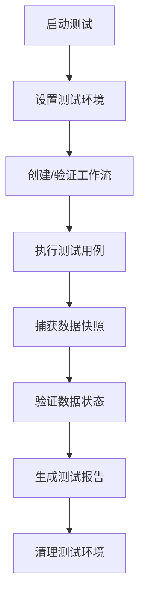

# 自动化前端流程测试 - 标准流程文档

## 🎯 测试目标

本测试系统专门用于验证**前端工作流的数据流转和数据管理**符合设计预期，确保：

1. **数据完整性** - 数据在节点间传递时保持完整
2. **数据变换正确性** - 节点按预期处理和变换数据
3. **流程执行顺序** - 工作流按正确的拓扑顺序执行
4. **错误处理机制** - 异常情况下的优雅降级

## 🏗️ 测试架构

### 核心组件

```
WorkflowTestFramework (测试框架核心)
├── TestRunner (测试运行器)
├── JsonDataFlowTests (JSON数据流转测试)
└── 未来扩展 (其他数据类型测试)
```

### 测试层次

1. **单元测试** - 单个节点的数据处理
2. **集成测试** - 多节点间的数据流转
3. **端到端测试** - 完整工作流的执行

## 🧪 JSON数据流转测试标准

### 测试用例覆盖

| 测试ID | 测试名称 | 测试目标 | 验证要点 |
|--------|----------|----------|----------|
| `json-generation-001` | 基础JSON生成测试 | ContentGenerator产生有效JSON | 数据类型、结构完整性 |
| `json-merge-002` | JSON合并测试 | JsonMerger正确合并多输入 | 合并逻辑、数据保留 |
| `json-filter-003` | JSON过滤测试 | JsonFilter正确过滤数据 | 过滤规则、字段保留/移除 |
| `json-workflow-004` | 完整JSON工作流测试 | 端到端数据流转 | 执行顺序、数据变换链 |
| `json-types-005` | 数据类型验证测试 | 不同JSON类型处理 | 类型兼容性、转换正确性 |
| `json-errors-006` | 错误处理测试 | 异常情况处理 | 错误恢复、数据完整性 |

### 数据验证机制

#### 1. 数据快照 (Data Snapshots)
```typescript
interface DataSnapshot {
  nodeId: string;
  nodeName: string;
  timestamp: number;
  inputData: any;        // 节点输入数据
  outputData: any;       // 节点输出数据
  properties: any;       // 节点属性状态
}
```

#### 2. 断言系统 (Assertion System)
```typescript
// 相等断言
assert({
  type: 'equals',
  expected: { id: 1, name: 'test' },
  actual: actualData,
  message: 'Generated data should match expected structure'
});

// 类型断言
assert({
  type: 'typeof',
  expected: 'object',
  actual: outputData,
  message: 'Output should be an object'
});

// 自定义断言
assert({
  type: 'custom',
  expected: (data) => Array.isArray(data) && data.length > 0,
  actual: resultArray,
  message: 'Should return non-empty array'
});
```

## 🚀 使用指南

### 快速开始

1. **启动测试面板**
   ```
   快捷键: Ctrl + Shift + T
   ```

2. **运行JSON测试**
   ```javascript
   // 在控制台中手动运行
   window.testFramework.runJsonTests();
   ```

3. **查看测试结果**
   - 测试面板显示实时结果
   - 控制台输出详细日志
   - 数据快照用于问题排查

### 测试流程

#### 标准测试执行流程



#### 单个测试用例流程

1. **Setup阶段** - 准备测试环境和数据
2. **Execute阶段** - 执行测试逻辑和验证
3. **Cleanup阶段** - 清理测试产生的状态

### 数据流验证标准

#### JSON数据标准结构

```json
{
  "id": "number|string",
  "name": "string", 
  "value": "any",
  "metadata": {
    "timestamp": "number",
    "source": "string"
  }
}
```

#### 必验证的数据流

1. **Start → ContentGenerator** - 初始数据生成
2. **ContentGenerator → JsonMerger** - 多数据源合并
3. **JsonMerger → JsonFilter** - 数据过滤处理
4. **JsonFilter → Display** - 最终数据展示
5. **Display → End** - 工作流完成

## 📊 测试报告格式

### 测试结果结构

```typescript
interface TestResult {
  success: boolean;           // 测试是否通过
  message: string;           // 结果描述
  details?: any;             // 详细信息
  executionTime: number;     // 执行时间(ms)
  dataSnapshots?: DataSnapshot[]; // 数据快照
}
```

### 测试覆盖率指标

- **节点覆盖率** - 测试覆盖的节点类型比例
- **连接覆盖率** - 测试覆盖的节点连接比例
- **数据类型覆盖率** - 测试覆盖的数据类型比例
- **错误场景覆盖率** - 测试覆盖的异常情况比例

## 🔧 扩展测试类型

### 添加新的数据类型测试

1. **创建测试类**
   ```typescript
   export class NewDataTypeTests {
     constructor(testFramework: WorkflowTestFramework) {
       this.testFramework = testFramework;
     }
     
     public getTestCases(): TestCase[] {
       return [
         // 定义测试用例
       ];
     }
   }
   ```

2. **集成到TestRunner**
   ```typescript
   // 在TestRunner中添加新的测试套件
   private getAvailableTestSuites(): TestSuite[] {
     return [
       // 现有测试套件...
       {
         id: 'new-data-type',
         name: 'New Data Type Tests',
         description: 'Test new data type processing',
         testCases: this.newDataTypeTests.getTestCases()
       }
     ];
   }
   ```

### 自定义断言函数

```typescript
// 创建领域特定的断言
function assertValidWorkflowData(data: any): void {
  testFramework.assert({
    type: 'custom',
    expected: (d) => {
      return d && 
             typeof d === 'object' && 
             'id' in d && 
             'timestamp' in d &&
             typeof d.timestamp === 'number';
    },
    actual: data,
    message: 'Data should follow workflow data schema'
  });
}
```

## 🎯 最佳实践

### 测试编写原则

1. **原子性** - 每个测试用例专注于单一功能点
2. **独立性** - 测试用例间不应相互依赖
3. **可重复性** - 测试结果在相同条件下应一致
4. **快速反馈** - 测试应快速执行并提供明确结果

### 数据验证策略

1. **结构验证** - 验证数据结构符合预期schema
2. **内容验证** - 验证数据内容的正确性
3. **边界验证** - 测试边界条件和极值情况
4. **错误验证** - 验证错误处理的正确性

### 性能考量

- 测试执行时间应控制在合理范围内
- 大数据量测试应使用采样或模拟
- 避免测试中的内存泄漏
- 合理设置测试超时时间

## 🚨 故障排查

### 常见问题

1. **测试失败但功能正常**
   - 检查测试数据是否符合实际业务逻辑
   - 确认断言条件是否过于严格

2. **数据快照显示异常**
   - 检查节点执行顺序
   - 验证数据传递机制

3. **测试执行超时**
   - 检查异步操作的处理
   - 确认没有无限循环或死锁

### 调试技巧

```javascript
// 启用详细日志
window.isTestEnvironment = true;

// 手动捕获数据快照
testFramework.captureDataSnapshot('node-id');

// 查看所有数据快照
console.table(testFramework.getDataSnapshots());

// 单步执行测试
await testFramework.runTest(singleTestCase);
```

---

## 📝 总结

这套自动化测试系统为前端工作流提供了**可靠、高效、可扩展**的测试解决方案。通过标准化的测试流程和数据验证机制，确保工作流的数据管理始终符合设计预期。

重点关注**JSON数据流转测试**作为基础测试标准，为后续扩展其他数据类型测试奠定坚实基础。